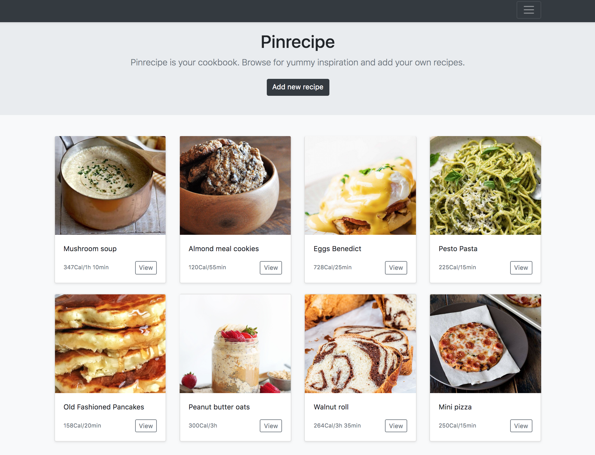

# Welcome to Pinrecipe :spaghetti: :pizza: :cookie:

As two food lovers, who like to test yummy recipes and who never found a perfect service to keep the favorite recipes together, we decided to make our own app to serve this purpose.
Pinrecipe is like Pinterest, but for recipes.
You can safely store your favorite recipes and browse for new ones by category: breakfast, lunch, dinner, dessert.

#
Thanks to our instructors:
 - Kenny Bushman,
 - Allen Wright,
 - Carson Butterfield,

 you helped us to go through the first full-stack project and be happy with it.
#

## Link to project hosted on Heroku

## Technologies Used
- HTML, CSS, Javascript, Bootstrap
- Jquery, Mongoose, Express
- MongoDB, NodeJS, Bycrypt

## Existing Features
- Browse for existing recipes and see their preparation time and calories per portion

- See the details of an invididual recipe and cooking method

- Add and store your own recipe

- Login to filter recipes by category

- Write/ Update/ Delete a review for a recipe

- Easy to share link of favorite recipe with friends

## Planned Features
- Logged in users will have their own recipe board where they can add, update and delete their own recipes
- Logged in users can make their own recipes private or public
- Refactor navigation bar
- Add validation rules on DB
- Pagination: show only first 10 recipes and show more when user reaches the bottom of the screen
- Reviews can be written only by logged in users
- Add user name to review
- User login via social media channels
- Users can search for reastaurants that serve those dished on an integrated map
- MVC refactoring
- Randomize recipe of the day